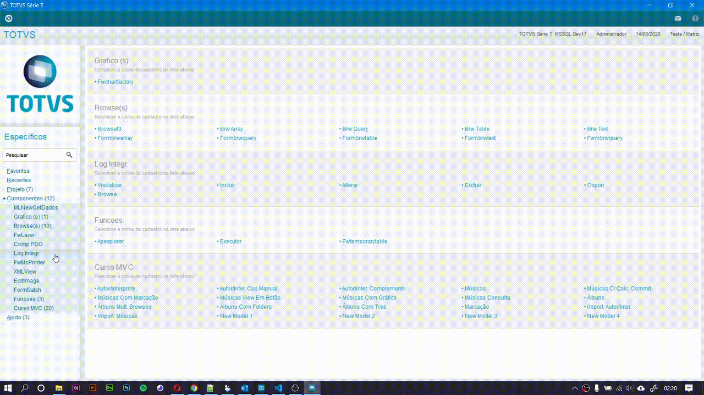

# Consumindo API REST - ADVPL POO

##### Progresso desenvolvimento: :eyes:


:white_check_mark: Interface de Log.

:o: Classe base para novas integrações.

:o: Classe de Integração ERP Protheus x Intelipost.

:o: Functions para execução das integrações.


```jsx
 [EXEMPLO DE COMO SERA A CHAMADA DA NOSSA INTEGRACAO]

//-- Busca os pedidos a serem integrados na pltaforma
aPedido  := GetPedidos()[1]
aVolumes := GetPedidos()[2]

//-- Inicializa objeto de integracao
oITLPost := INTELIPOST():New()
		
//-- Dispara integração para inclusão de pedido na plataforma Intelipost
lRet := oITLPost:IncPedido(aPedido,aVolumes)

```


##### Parte 01: Criação da interface de Log. :white_check_mark:


Partiremos na construção de uma interface de log com o propósito de oferecer a consulta de todos os registros que foram disparados no processo de integração, toda troca de dados terá seu status indicando se a mensagem foi entregue com sucesso ou não, isso na eventualidade de falhas de conexão com a API ou erros de regra de negócio. O parão de arquitetura <b>MVC </b> também será aplicado neste contexto, pois o mesmo nos beneficiará em vários aspectos, seja na velocidade na construção de tela, melhor manutenção e pelo reuso, onde faremos o instanciamento do objeto (Modelo de dados) para gravação dos dados.


